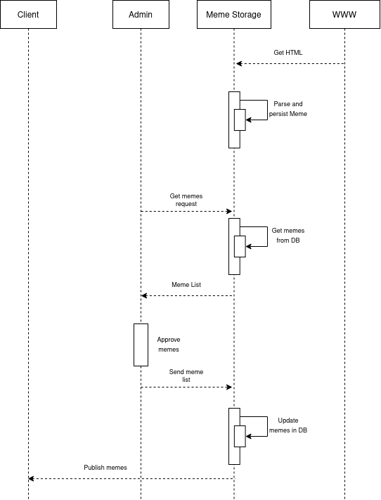

# Meme Dealer
Microservice project for parsing memes from some resources and delivering them to users.

## Links
- Telegram: https://t.me/hey_memedealer

## Stack
1) Spring Boot
2) MongoDB
3) RabbitMQ

## Components relationship diagram

